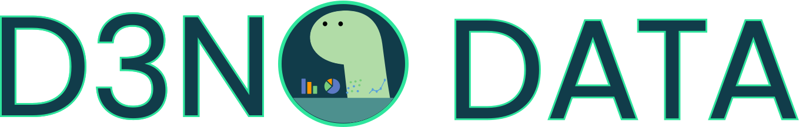

Check out the component library on [github](https://github.com/oslabs-beta/d3no-data/) or [deno.land](https://deno.land/x/d3nodata), and visit our website (coming soon) to learn about the library and get started.

